# Python API- What's the Weather Like?

## Background

Whether financial, political, or social -- data's true power lies in its ability to answer questions definitively. So let's take what you've learned about Python requests, APIs, and JSON traversals to answer a fundamental question: "What's the weather like as we approach the equator?"

Now, we know what you may be thinking: _"Duh. It gets hotter..."_

But, if pressed, how would you **prove** it?

## Part I - WeatherPy

In this example, you'll be creating a Python script to visualize the weather of 500+ cities across the world of varying distance from the equator. To accomplish this, you'll be utilizing a [simple Python library](https://pypi.python.org/pypi/citipy), the [OpenWeatherMap API](https://openweathermap.org/api), and a little common sense to create a representative model of weather across world cities.

### Generated Scatterplots comparing Latitude to Temperature, Humidity, Cloudiness, and Wind Speed:

* Temperature (F) vs. Latitude

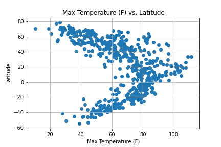

* Humidity (%) vs. Latitude

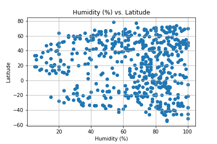

* Cloudiness (%) vs. Latitude

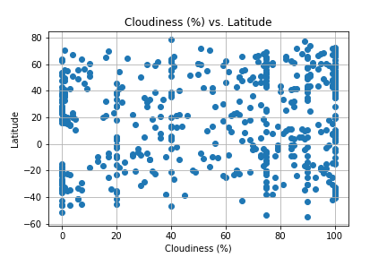

* Wind Speed (mph) vs. Latitude

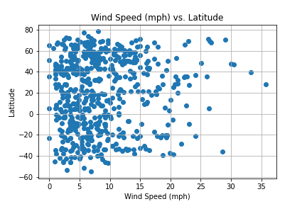

### Generated Linear Regressions of Temperature, Humidity, Cloudiness, and Wind Speed of northern and southern hemishphere:

* Northern Hemisphere - Temperature (F) vs. Latitude

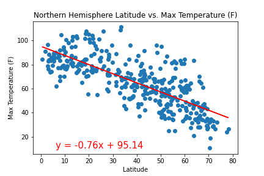

* Southern Hemisphere - Temperature (F) vs. Latitude

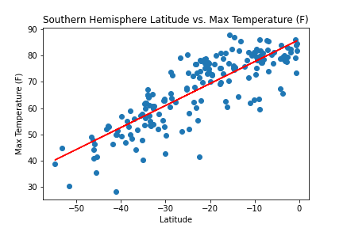

* Northern Hemisphere - Humidity (%) vs. Latitude

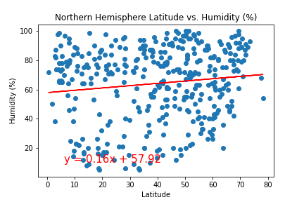

* Southern Hemisphere - Humidity (%) vs. Latitude

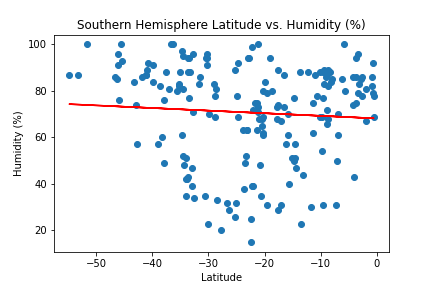

* Northern Hemisphere - Cloudiness (%) vs. Latitude

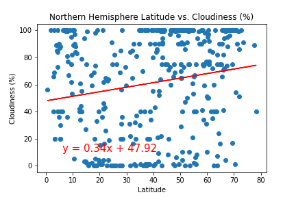

* Southern Hemisphere - Cloudiness (%) vs. Latitude

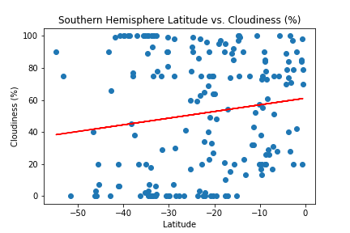

* Northern Hemisphere - Wind Speed (mph) vs. Latitude

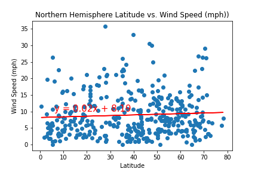

* Southern Hemisphere - Wind Speed (mph) vs. Latitude

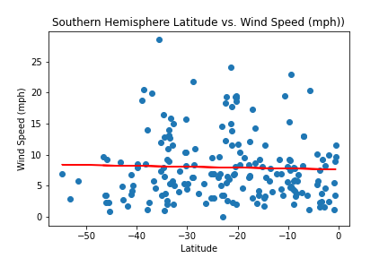

### The final notebook must:

* Randomly select **at least** 500 unique (non-repeat) cities based on latitude and longitude.
* Perform a weather check on each of the cities using a series of successive API calls.
* Include a print log of each city as it's being processed with the city number and city name.
* Save a CSV of all retrieved data and a PNG image for each scatter plot.

## Part II - VacationPy

Now let's use your skills in working with weather data to plan future vacations. Use jupyter-gmaps and the Google Places API for this part of the assignment.

* Create a heat map that displays the humidity for every city from the part I of the homework.

* Narrow down the DataFrame to find your ideal weather condition. For example:

  * A max temperature lower than 80 degrees but higher than 70.

  * Wind speed less than 10 mph.

  * Zero cloudiness.

  * Drop any rows that don't contain all three conditions. You want to be sure the weather is ideal.

* Using Google Places API to find the first hotel for each city located within 5000 meters of your coordinates.

* Plot the hotels on top of the humidity heatmap with each pin containing the **Hotel Name**, **City**, and **Country**.

